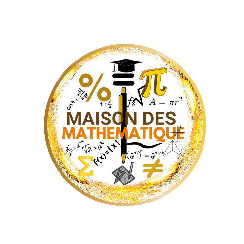

  

<h1 align="center" style="color:#4f8cff;font-family:Fredoka, Arial, sans-serif;">
  Maison Des Maths
</h1>

  <em>Découvre les mathématiques de façon ludique et interactive !</em>

---

  <a href="Accueصil.html#">Accueil</a> •
  <a href="NiveauxScolaires.html">Niveaux Scolaire</a> •
  <a href="Contact.html">Contact</a> •
  <a href="Quis.html">Quiz</a> •
  <a href="Défis.html">Défis</a> •
  <a href="jeux.html">Jeux</a>

---

## 🎲 Bienvenue sur Maison Des Maths !

Apprends, joue et progresse en mathématiques grâce à des activités amusantes, des jeux interactifs et des défis adaptés à tous les niveaux, du primaire au lycée.

---

## ✨ Nos fonctionnalités

|  |  |  |
|:---:|:---:|:---:|
| **Jeux Mathématiques** Résous des énigmes, puzzles et casse-têtes pour t'amuser tout en apprenant. <a href="jeux.html">Découvrir les jeux</a> | **Cours Interactifs** Des leçons claires et illustrées pour comprendre chaque notion facilement. <a href="NiveauxScolaires.html">Explorer les niveaux scolaires</a> | **Quiz & Défis** Teste tes connaissances et défie tes amis avec des quiz adaptés à ton niveau. <a href="Quis.html">Participer aux quiz</a> |

---

## 📚 Pour qui ?

- Élèves du primaire jusqu’au lycée
- Enseignants souhaitant des supports interactifs et ludiques
- Parents qui veulent accompagner leurs enfants dans la découverte des maths

---

## 📬 Contact

Une question, une suggestion ou envie de rejoindre l’aventure ?  
📧 [Nous contacter](Contact.html)

---

## 🧩 À propos

**Maison Des Maths** est un site dédié à rendre l’apprentissage des mathématiques accessible, amusant et interactif.  
Notre équipe passionnée conçoit des ressources originales, des jeux et défis pour stimuler la curiosité et le plaisir de progresser en maths.

---

  © Un lieu magique, une passion logique : bienvenue à la Maison des Maths.

